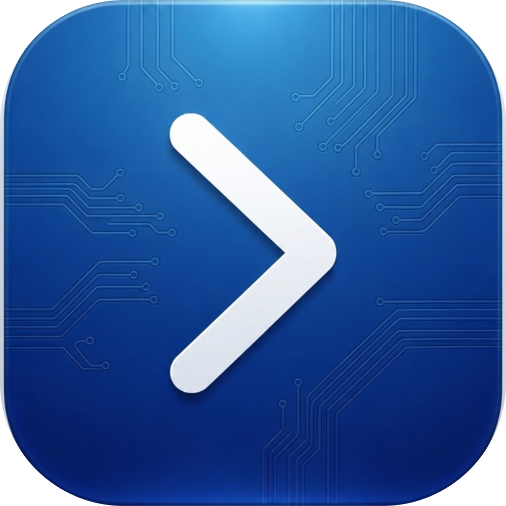

<p align="center">
  
</p>

<h1 align="center">Agent Terminal</h1>

<p align="center">
An integrated terminal in your browser that lets you use AI coding agents to control live tabs (works with Claude Code, Codex, Cursor, Hermes, and more).
</p>

<p align="center">
  <a href="LICENSE"></a>
  <a href="https://go.dev/"></a>
  <a href="https://developer.chrome.com/docs/extensions/mv3/"></a>
</p>

Connect your agents to Chrome with interactive browser automation, in Chrome’s side panel, on your live tabs.

**Note:** this project is experimental. Agents can control your live Chrome and run shell commands on your machine. Use with care.

## Why Agent Terminal

This extension lets coding agents drive the page you’re looking at: open, click, fill, snapshot in your real Chrome, while you watch and intervene.


|                             | Agent Terminal                                   | IDE / Terminal.app alone                   |
| --------------------------- | ------------------------------------------------ | ------------------------------------------ |
| Interactive browser + agent | Side panel interaction next to live browser tabs | Easy to spawn invisible tabs you never see |
| You stay in the loop        | Same window (watch the agent, take over anytime) | Automation often runs off-screen           |
| One-click agents            | Claude / Codex / Cursor / Hermes / OpenClaw      | Manual shells and PATH                     |


## Quick start

**Prerequisites:** Go 1.24+, Node.js 20+, Chrome.

```sh
git clone https://github.com/rishiskhare/agent-terminal.git
cd agent-terminal
go build -o agent-terminal .
./agent-terminal install
cd extension && npm install && npm run build
```

Then load the extension in Chrome:

1. Open `chrome://extensions`
2. Turn on **Developer mode**
3. Click **Load unpacked** and choose the `extension/dist/chrome-mv3` folder in this repo
4. Open the side panel from the Agent Terminal extension icon

## How it works

This extension uses Vercel’s [agent-browser](https://github.com/vercel-labs/agent-browser) CLI, so the extension never touches page DOM. Browser automation runs using normal CLI tools inside the PTY. Agent Terminal does not add heavy MCP servers or a custom automation stack.

It is a real terminal in Chrome’s side panel: your shell, local files, `git`, language toolchains, existing CLI/agent tools, and whatever else is on your `PATH`. By default, coding agents are guided to use agent-browser on your live Chrome tabs through an [AGENTS.md](internal/cmd/embed/AGENTS.md) file (custom instructions can be configured by directly editing this file).

Because it is just a terminal, you can use any browser automation you prefer: [agent-browser](https://github.com/vercel-labs/agent-browser), Playwright, Puppeteer, Selenium, Chrome DevTools Protocol, or another CLI/MCP you already trust.

## Usage

- **Browse freely:** while your agent browses the web, you can browse other tabs. No need to keep the agent’s working tab in focus.
- **Tabs:** up to 8 terminals per Chrome window
- **One-Click Agent Launcher:** `+` runs your last agent; dropdown menu for Claude, Codex, Cursor, Hermes, OpenClaw, or Terminal
- **Settings:** shell, theme, font size, env, and Run doctor in Chrome extension options

## Features

- **Session survival:** close the side panel and reopen later; the agent is still running
- **Isolated sessions:** concurrent agents each get their own browser session
- **Live Chrome only:** attaches to your Chrome (never Chrome-for-Testing)
- **Setup doctor:** detects agent CLIs and sets up launchers plus `AGENTS.md`

## Live Chrome

Agents attach to the Chrome you’re already using. They will not start Chrome-for-Testing. You can keep browsing other tabs; the agent does not need its tab focused to keep working.

1. Turn on remote debugging once at `chrome://inspect/#remote-debugging` (leave Chrome open)
2. Click **Allow** if Chrome asks after a restart

## Contributing

PRs welcome. For large changes, open an issue first. Keep the extension free of page host permissions, and keep browser automation on the user’s live Chrome.

## License

This project is licensed under the MIT License. See [LICENSE](LICENSE). Based on [Tweety](https://github.com/pomdtr/tweety) by Achille Lacoin.
